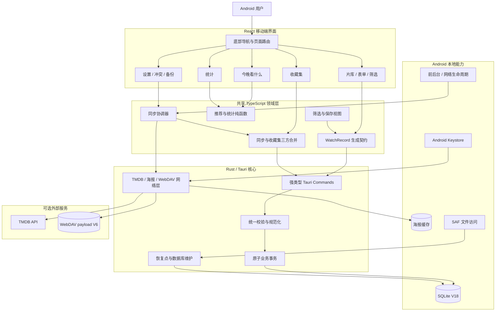
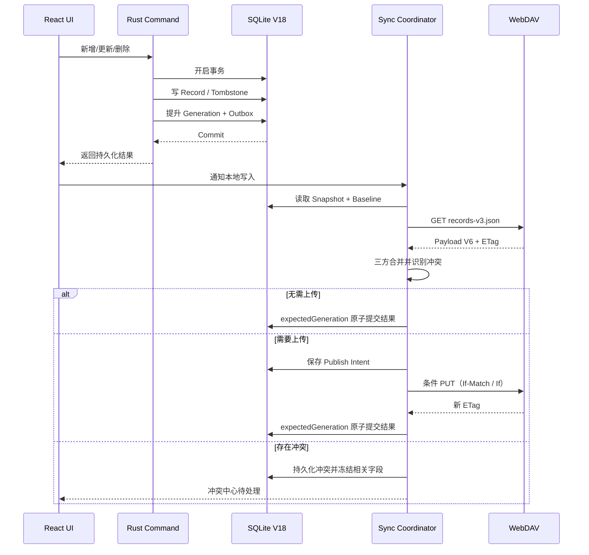
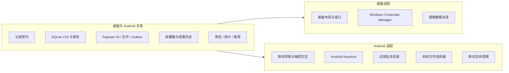

# WatchTracker 新版 Android 完整项目规划

> 文档状态：Draft v1  
> 编写日期：2026-08-23  
> 产品基线：`../WatchTracker-Main` 1.10.2 / SQLite V18 / WebDAV payload V6  
> 旧版参考：`../WatchTracker-Android`（只读参考，不作为代码基线）

## 1. 项目摘要

新版 WatchTracker Android 是桌面端 WatchTracker 的移动客户端。项目采用“共享领域规则与数据协议、重新设计移动端交互、隔离平台能力”的方式建设，目标是在 Android 手机上安全、离线地管理影视记录，并与桌面端通过 WebDAV 可靠同步。

新版不从旧 Android 代码继续叠加，而是以桌面主线的记录契约、SQLite V18、同步协议和测试不变量为权威基线。旧 Android 仅用于参考已经验证过的 Tauri Android 构建配置、移动端布局、剪贴板和网络接入方式。

### 1.1 核心目标

1. Android 与桌面端共享同一业务数据模型及 WebDAV payload V6。
2. 本地 CRUD、逐集历史、收藏集、导入和同步均保持事务一致性。
3. 应用在无 TMDB、无 WebDAV和无网络时仍可完整管理本地片库。
4. 两端并发修改不会被静默覆盖，冲突必须可见、可解释、可恢复。
5. 凭据由 Android Keystore 保护，不以明文或 Base64 形式保存在 SQLite。
6. 交互符合手机使用习惯，而不是简单缩放桌面页面。
7. 建立可持续的契约测试、Rust 测试、前端测试、Android 构建和真机回归体系。

### 1.2 首版非目标

- 不在 Android 1.0 中提供 Android TV 版本。
- 不在首个 Beta 中承诺应用被系统终止后的周期后台同步。
- 不建设账号服务器、中心化云服务或自有用户系统。
- 不支持多个本地片库数据库同时打开。
- 不允许 Android 维护与桌面端不同的业务 schema 分支。
- 不把 TMDB、WebDAV 或任何外部服务设为离线 CRUD 的前置条件。

## 2. 用户场景

### 2.1 核心用户

- 已在 Windows 桌面端使用 WatchTracker，希望手机随时更新进度的用户。
- 只使用 Android、希望本地优先且能自行备份的用户。
- 从旧 Android V9 迁移到新版的现有用户。

### 2.2 关键使用场景

1. 通勤途中快速查看“下一集”和更新观看进度。
2. 搜索 TMDB 并在几十秒内添加一部电影或一季剧集。
3. 离线添加、编辑或删除记录，联网后安全合并到桌面端。
4. 从收藏集查看一套电视剧或电影系列的完整顺序。
5. 使用“今晚看什么”从未看列表中选择内容。
6. 更换手机时通过 JSON/恢复点或 WebDAV 恢复数据。
7. 同一记录在桌面和手机被同时修改时，查看并解决冲突。

## 3. 产品信息架构

Android 采用五个一级入口和一个全局添加动作：

| 一级入口 | 主要职责 |
| --- | --- |
| 片库 | 记录列表、海报墙、搜索、筛选、保存视图、快速进度 |
| 发现 | “今晚看什么”、筛选候选、跳过和查看推荐原因 |
| 收藏 | 电视剧系列、电影合集、影视宇宙和手工收藏集 |
| 统计 | 观看时长、完成趋势、类型、题材和平台分布 |
| 设置 | 基础设置、TMDB、WebDAV、备份、恢复、缓存和关于 |
| 全局添加 | 从底部导航中央 FAB 进入 TMDB 搜索或手工添加 |

手机端页面约定：

- 添加和编辑使用全屏页面；平板可升级为大尺寸对话框。
- 高级筛选使用 Bottom Sheet，当前条件显示为可移除 Chip。
- 详情页承担完整信息和危险操作，列表卡片只保留高频动作。
- Android 系统返回键依次关闭弹层、退出详情、返回上一级，最后才退出应用。
- 所有写操作显示成功或失败反馈；同步冲突不能只用短时 Toast 表达。

## 4. 完整功能范围

### 4.1 片库与记录管理

#### 必须实现

- 新增、查看、编辑、删除影视记录。
- 支持电影、剧集、纪录片、综艺、动画五种媒体类型。
- 支持中文名、原名、年份、海报、平台、题材、地区、评分、备注等信息。
- 支持未看、在看、已看三种状态。
- 支持锁定记录；导入和同步不得覆盖锁定记录。
- 支持列表和海报墙两种视图。
- 支持按创建时间、完成时间、评分、年份和观看价值排序。
- 支持名称、平台和备注搜索。
- 支持状态、类型、地区、平台、题材、锁定状态、评分和年份组合筛选。
- 支持保存、更新、删除筛选视图，并可设为启动视图。
- 电影观看进度以秒保存，UI 使用小时/分钟表达。
- 分集内容显示总集数、单集时长和下一集。

#### 移动端增强

- 列表卡片提供“完成本集”“设为已看”“继续观看”等高频动作。
- 搜索框支持输入防抖和清除。
- 长列表支持分段渲染或虚拟化，目标为 10,000 条记录仍可操作。
- 空列表、无搜索结果、筛选无结果分别展示明确引导。

### 4.2 逐集观看历史

- 为分集内容启用逐集跟踪。
- 保存 `nextEpisode` 和逐集完成时间。
- 完成本集、跳至指定集、回退进度。
- 完结时原子更新状态、结束日期和完成历史。
- 已完结剧集增加总集数后支持“继续追更”。
- 同步时合并逐集完成历史；不同非空完成时间进入冲突处理。
- 旧文本 `progress` 不自动猜测为逐集历史，迁移时保留原值。

### 4.3 TMDB 元数据

- 配置、检测和清除 TMDB API Key。
- 电影、电视剧、电视剧季搜索。
- 多匹配结果由用户选择，不自动猜测。
- 获取名称、年份、海报、题材、国家、状态、集数和时长。
- 保存 `tmdbMediaKind`、`tmdbId`、`tmdbParentId`、季号和记录类型。
- 批量补全只写缺失字段，不覆盖用户已有值。
- 对 TMDB 无数据字段保留本地记忆，避免重复请求。
- 网络失败不能阻塞本地手工新增。
- 海报统一由 Rust 下载、校验并缓存，WebView 不直接读取 TMDB 图片。

### 4.4 收藏集与系列

- 创建、编辑和删除手工收藏集；删除收藏集不删除记录。
- 一条记录可以属于多个收藏集。
- 支持手工顺序和时间顺序。
- 支持电视剧系列、电影系列、影视宇宙和普通收藏四种类型。
- 显示收藏集成员、缺失内容、身份冲突和无法确认项。
- 根据稳定 TMDB 身份建议系列归组，最终操作由用户确认。
- 为电视剧创建缺失季，并避免父剧＋季号重复。
- 为电影合集复用片库已有记录，仅创建真正缺失的项目。
- 收藏集、成员和对应 tombstone 进入备份与 WebDAV 同步。

### 4.5 “今晚看什么”

- 只从未看记录生成推荐队列，锁定记录可以参与。
- 支持媒体类型、平台、最大观看时长和制作状态筛选。
- 电影按整部估算，分集内容按单集估算。
- 显示推荐原因和可解释的评分构成。
- 支持跳过、下一条和打开只读详情。
- 同一会话不重复推荐；该功能不修改业务数据。

### 4.6 统计看板

- 总记录数及未看、在看、已看数量。
- 指定时间范围的观看时长和完成数量。
- 年/月完成趋势。
- 媒体类型、题材、地区和平台分布。
- 正在观看列表及电影/剧集差异化进度。
- 小屏使用纵向卡片和可横向滚动的必要图表，不照搬桌面多栏布局。

### 4.7 WebDAV 同步

- 自定义 WebDAV URL、用户名和密码，不限定坚果云。
- 同步目标探测后才允许激活。
- 使用与桌面端一致的 `records-v3.json` 和 payload V3～V6 读取能力。
- V7 及未知更高版本明确拒绝，且不得上传。
- 使用 ETag 条件写；缺失可靠验证器时禁止危险覆盖。
- 共同 baseline 三方字段合并。
- 使用 tombstone 同步删除。
- 使用 `expectedGeneration` 防止网络等待期间的新本地写入被覆盖。
- 使用持久 outbox、staging 和 publish intent 处理崩溃恢复。
- 支持多同步目标状态隔离和安全切换。
- 支持启动、回到前台、网络恢复、周期到期和手动同步触发。
- 支持暂停、重试退避、错误分类和冲突中心。
- 切换目标前只读探测；确认后执行 Pull → Merge → Push。

### 4.8 导入、导出与恢复

- 导出包含记录、逐集历史、收藏集和成员关系的本地 JSON V3。
- 通过 Android Storage Access Framework 选择导入文件和导出目录。
- 导入前验证 schema、字段和值域并展示预览。
- 高风险替换前自动创建恢复点。
- 支持列出、保留、删除和恢复本地恢复点。
- 支持 SQLite VACUUM、数据库基本健康检查和海报缓存清理。
- 恢复数据库后重新加载全部前端状态，不保留旧内存快照。

### 4.9 旧版迁移

#### 旧 Android SQLite V9

- 检测 V9 数据库或由用户通过系统文件选择器导入。
- 迁移前保存原文件副本并计算基本校验信息。
- 保留原记录 ID、名称、日期、评分、进度、锁定和自定义顺序。
- `category` 按已知分类映射为 `mediaType`、地区标签或自定义标签。
- 无法确定的分类保留在 `contentTags`，不能静默丢弃。
- 为缺失同步字段生成安全初值：`updatedAt`、`rev`、`revActor`。
- 旧 `watch_logs` 若没有可靠业务定义，首版只归档，不猜测转换。
- 迁移完成后输出数量、警告和未映射项报告。

#### 旧 WebDAV `records.json`

- 只读下载并预览旧数组。
- 转换为兼容导入数据后写入本地事务。
- 创建恢复点并完成首次 V6 发布确认。
- 不直接把旧资源覆盖为新格式；保留旧文件供回滚。

### 4.10 设置与平台功能

- 主题跟随系统；预留浅色/深色手动选项。
- 同步防抖间隔、主动拉取间隔、代理和缓存容量设置。
- Android Keystore 凭据保存与重新输入流程。
- 剪贴板粘贴、系统分享和系统文件选择器。
- 应用版本、构建提交号、数据库版本和同步协议版本展示。
- 隐私说明、开源许可和诊断日志导出。
- 日志不得包含 API Key、密码、Authorization 或带秘密的 URL。

### 4.11 可访问性与本地化

- 所有图标按钮具备可读标签。
- 弹层具备焦点约束和返回键关闭行为。
- 触控目标原则上不小于 48dp。
- 支持系统字体缩放至 200% 时完成核心流程。
- 状态不能仅用颜色表达。
- 首版界面使用简体中文，文本集中管理，为后续国际化保留边界。

## 5. 实现概念图

### 5.1 总体实现概念图



### 5.2 本地写入与同步概念图



### 5.3 平台复用边界



## 6. 技术架构

### 6.1 技术栈

| 层级 | 选择 |
| --- | --- |
| UI | React 19、TypeScript、TailwindCSS |
| 容器 | Tauri 2 Android |
| 核心 | Rust 2021 |
| 数据库 | rusqlite / bundled SQLite，schema V18 |
| 网络 | Rust reqwest；WebView 不直接持有秘密 |
| 图表 | Recharts，按移动屏幕重排 |
| Android | Kotlin/Gradle 生成工程，必要时添加最小原生插件 |
| 测试 | Node test、Rust test、Playwright、Android instrumentation |
| 构建 | npm lockfile、Cargo lockfile、Gradle wrapper、CI |

初始 Android 基线建议：

- `minSdk 26`，覆盖 Android 8 及以上。
- `compileSdk/targetSdk 36`，在发布前根据商店规则复核。
- 首要 ABI 为 `arm64-v8a`；是否发布其他 ABI 由体积和设备需求决定。
- Debug 使用独立 application ID 后缀，避免覆盖正式数据。

### 6.2 建议目录结构

```text
WatchTracker-Android-New/
├── contracts/                    # 从主线同步的记录契约
├── docs/
│   ├── PROJECT_PLAN.md
│   ├── ARCHITECTURE.md
│   ├── DATA_MIGRATION.md
│   └── RELEASE_CHECKLIST.md
├── src/
│   ├── app/                      # 初始化、路由、移动壳层
│   ├── features/
│   │   ├── library/
│   │   ├── records/
│   │   ├── episode-history/
│   │   ├── discovery/
│   │   ├── collections/
│   │   ├── dashboard/
│   │   ├── sync/
│   │   ├── migration/
│   │   └── settings/
│   ├── platform/android/         # 生命周期、文件、返回键等适配
│   └── shared/                   # 类型、纯函数和通用组件
├── src-tauri/
│   ├── src/
│   │   ├── domain/               # 校验和业务规则
│   │   ├── persistence/          # SQLite/事务/恢复点
│   │   ├── sync/                 # snapshot/outbox/staging
│   │   ├── network/              # TMDB/海报/WebDAV
│   │   ├── platform/             # Android Keystore/路径
│   │   └── commands/             # IPC 边界
│   └── gen/android/
├── tests/                        # 页面与跨端协议测试
└── package.json
```

### 6.3 代码复用策略

#### 优先直接复用

- `contracts/watch-record.schema.json` 及生成脚本。
- Rust record validation、V18 schema、原子 CRUD。
- episode history、collections、recovery points。
- sync payload、merge、outbox、staging、target isolation。
- classification、filtering、analytics、discovery 等纯函数。
- TMDB 映射和候选资格规则。

#### 需要平台适配后复用

- 数据路径：Android 只使用应用私有目录。
- 凭据：以 Android Keystore 替换 WinCred。
- 导入导出：以 SAF 替换桌面文件操作。
- 海报协议：复核 Android WebView 自定义协议行为和路径校验。
- 生命周期同步：监听前后台与网络恢复，不能只依赖 JS timer。
- 日志和诊断文件分享。

#### 不直接复制

- 桌面 `App.tsx` 的页面编排和顶部工具栏。
- Windows 便携目录与 Windows shell 命令。
- 旧 Android V9 database、Base64 auth 和覆盖式 WebDAV。
- 旧 Android `category` 作为业务主分类的设计。

## 7. 数据设计与兼容性

### 7.1 权威记录契约

记录模型以桌面主线生成契约为唯一来源，核心字段包括：

- 身份：`id`、`imdbId`、TMDB 类型与 ID、父剧 ID、季号。
- 展示：中英文名称、年份、海报、类型、题材、地区和标签。
- 观看：状态、进度、总集数、下一集、电影时长、开始/结束日期。
- 用户数据：平台、评分、兴趣等级、备注和锁定。
- 同步：`createdAt`、`updatedAt`、`rev`、`revActor`。

任何字段变化必须先修改独立 schema，再生成 Rust/TypeScript 类型，并通过漂移检查。

### 7.2 本地数据库

- 数据库主版本保持 V18，不因 Android 单独提升版本。
- Android 平台能力需要新表时，优先使用幂等功能 migration 和独立 feature version。
- 开启外键并为关键写入使用显式事务。
- 高风险 migration 前创建并校验备份。
- 未知更高版本明确拒绝，禁止猜测降级。

### 7.3 跨端兼容规则

- 桌面端和 Android 同步使用相同远端文件与 schema。
- Android 不得在序列化时删除它暂时不展示的字段。
- 新版本首次提升 payload schema 必须由用户确认，并先保证旧版本安全拒绝。
- 所有导入和同步替换必须保留锁定记录的本地版本。

## 8. 安全与隐私

1. WebDAV 和 TMDB 秘密保存于 Android Keystore 保护的存储中。
2. React 只获取“是否已配置”状态；日常网络调用不把已保存秘密返回 WebView。
3. Release 禁止明文 HTTP，代理例外需明确提示风险。
4. WebDAV URL 显示时移除 userinfo、查询秘密和 fragment。
5. 海报下载限制响应大小、类型、并发和缓存总容量。
6. 自定义海报协议必须验证文件名，禁止 `..`、分隔符和任意文件读取。
7. 导入文件设置大小上限，并在写数据库前完成完整解析和验证。
8. 日志统一脱敏；诊断导出前再次过滤敏感字段。
9. Debug 与 Release 使用不同 application ID 和数据目录。
10. 发布包启用签名、混淆/压缩并保存 mapping 文件。

## 9. 同步触发策略

### 9.1 Android 1.0 前台同步

- 应用启动完成后检查远端。
- 从后台回到前台且超过冷却时间时检查远端。
- 网络从离线恢复时检查远端。
- 本地写入后通过持久 outbox＋防抖安排同步。
- 用户可下拉或从同步状态菜单手动触发。
- 暂停、退避和下次尝试时间跨重启保存。

### 9.2 后台同步扩展

后台周期同步作为 1.x 独立工作包：

- 由 Android WorkManager 调度，而不是依赖 React timer。
- 仅在已配置目标、未暂停且网络条件满足时运行。
- 复用 Rust 同步核心或调用受控原生入口。
- 遵守 Android 后台限制，不承诺精确时间。
- 先做不上传的远端变化检测，再逐步放开完整 Pull → Merge → Push。

## 10. 项目阶段与里程碑

### M0：工程基线与风险 Spike（3～5 个工作日）

交付：

- 从桌面主线提取新版工程基线。
- Tauri Android 初始化和 arm64 Debug APK。
- SQLite V18 启动、一次本地 CRUD 和重启持久化。
- TMDB、海报协议、WebDAV GET、Keystore 和 SAF 技术验证。
- CI 中完成前端检查、Rust 检查和 Android Debug 构建。

退出标准：真机可离线新增记录，重启后数据存在；所有高风险平台能力有明确结论。

### M1：离线片库 Alpha（8～10 个工作日）

交付：

- 移动端导航、片库、列表、海报墙和详情。
- CRUD、锁定、状态、搜索、排序和基础筛选。
- TMDB 搜索、详情映射和安全海报缓存。
- 逐集跟踪和快捷完成本集。
- 初始化错误、空状态和通知区域。

退出标准：不配置网络凭据也能完成核心片库流程；关键业务 Rust/前端测试通过。

M1.2（已完成）边界：移动片库使用独立的移动工具栏、筛选 Sheet、列表/海报墙、只读详情和全屏表单；偏好键为 `mobile_library_preferences_v1`，不持久化搜索、滚动或草稿。普通移动 CRUD 在不改变 Rust CRUD/schema 的前提下 reload 并比较 `rev`/锁定状态，明确不是原子 CAS。

M1.3（已完成）边界：移动片库为非电影且具有合法 `totalEpisodes` 的记录提供显式逐集跟踪。列表只保留“完成本集”等高频动作，详情提供选择初始下一集、完成、跳集、回退、原子完结、逐集历史及增集后继续追更。所有逐集写入复用 Rust `enable_episode_tracking` / `set_next_episode` 的原子事务和 `expectedRev`；UI 只采用 Rust 返回的持久化记录与历史，stale/missing/locked 均 reload 且不显示乐观成功。旧文本 `progress` 原样保留，锁定记录严格只读。本批次不改变 schema/migration，也不接入 TMDB、同步 UI、SAF、Keystore、收藏集或高级筛选。

### M1.4：Mobile Sync MVP（已完成）

为提前交付“Android 更新观看进度并同步到桌面”这一高价值路径，路线优先级在 M1.3 后插入移动同步 MVP。该阶段不是新协议，也不代表完整 M3 已完成。

交付：

- Android Keystore AES-GCM 正式凭据适配器；密码不回到 WebView，也不以明文进入 SQLite、普通文件或日志。
- 移动 repository 的所有本地写入接入现有 `useSyncCoordinator`，逐集记录和 `episodeCompletions` 共用原有 outbox。
- 移动同步设置：只读 Probe 后确认激活、立即同步、暂停/恢复、清除凭据、状态/outbox/conflict 展示和最小冲突解决。
- 启动、本地写入、联网恢复、Android 前台恢复和手动同步触发；本地片库就绪不依赖同步成功。
- 完整复用 `records-v3.json`、payload V3～V6、ETag/conditional PUT、412 retry、three-way merge、tombstone、generation、staging、publish intent 与 target ID/epoch 隔离。
- 受控本机 WebDAV 的 Android M1.4 smoke，验证 Keystore 重启复用、跨端逐集进度、前台合并、412、离线 outbox、清除凭据和敏感信息边界。

退出标准：同一 WebDAV 目标上的桌面种子可由 Android 拉取；Android 完成本集后记录和逐集历史可靠发布；网络或凭据失败不阻塞本地 CRUD；M1.4 自动化与 Android 设备门禁通过。证据见 `docs/M1_4_VERIFICATION.md`。

### M2：迁移、导入与恢复（5～8 个工作日）

交付：

- V9 数据迁移器和迁移报告。
- JSON V3 导入导出。
- SAF 文件选择器。
- 恢复点管理、VACUUM 和数据库健康检查。
- 脱敏真实副本迁移演练。

退出标准：记录数量和关键字段核对一致；失败迁移不修改活动数据库。

### M3：跨端可靠同步 Beta（8～12 个工作日）

M1.4 只提前复用了此阶段的可靠同步核心和移动主路径。M3 仍保留为完整 Beta，继续覆盖完整设备并发矩阵、更完整冲突 UX、多 target 全矩阵、崩溃恢复矩阵、后续 lifecycle/后台扩展及更广泛系统版本与真机验证。

交付：

- WebDAV target、Keystore 凭据和连接探测。
- payload V3～V6、ETag、三方合并和 tombstone。
- generation、outbox、staging、publish intent 和退避。
- 多目标隔离、冲突中心和恢复流程。
- 启动、前台恢复、联网恢复和手动触发。

退出标准：桌面与 Android 的离线并发、删除/编辑、锁定、412 和崩溃恢复矩阵全部通过。

### M4：完整功能对齐 RC（8～12 个工作日）

交付：

- 收藏集与系列补全。
- “今晚看什么”。
- 高级筛选和保存视图。
- 批量元数据补全。
- 完整统计与设置工具。
- 海报缓存管理和诊断导出。

退出标准：产品功能矩阵中 Android 1.0 项全部完成，无阻断级缺陷。

### M5：发布准备（5～7 个工作日）

交付：

- Release 签名、AAB/APK、版本和升级流程。
- 安全、性能、可访问性和低内存恢复验证。
- Android 8、11、14、16 真机/模拟器矩阵。
- 隐私说明、许可、发布说明和回滚手册。
- 从 Beta 数据升级至正式版的演练。

退出标准：所有发布门禁通过；升级、迁移、同步和回滚均有可执行证据。

### 总工期估算

- 单人全职：约 7～10 周。
- 两人并行（核心/同步与移动 UI 分工）：约 5～7 周。
- 后台 WorkManager 同步、Android TV、平板专用布局不计入 Android 1.0 工期。

## 11. 测试策略

### 11.1 契约测试

- schema 生成文件无漂移。
- Rust 与 TypeScript 枚举、字段和值域一致。
- Android 读取桌面 payload V3～V6，安全拒绝 V7。

### 11.2 Rust 单元与集成测试

- V18 migration、V9 导入映射和未知版本拒绝。
- 原子 CRUD、锁定保护、tombstone 和 generation。
- 逐集历史和收藏集事务。
- 同步 commit、staging、publish intent 和恢复点。
- 海报路径、响应大小、缓存回收和秘密存储边界。

### 11.3 TypeScript 测试

- 分类、筛选、保存视图、显示标题。
- 推荐、统计、TMDB 映射和收藏候选资格。
- sync merge、payload、错误分类和调度策略。
- 导入规范化和迁移报告生成。

### 11.4 UI 与端到端测试

- 初始化 loading/ready/error 和重试。
- 新增、编辑、删除、锁定、筛选和逐集进度。
- 保存视图、收藏集、发现和设置流程。
- 返回键、键盘、旋转、字体放大和对话框焦点。
- 模拟同步冲突、断网、412、远端未知版本和数据库恢复。

### 11.5 跨端同步矩阵

必须覆盖：

- Android 新增 → 桌面拉取。
- 桌面新增 → Android 拉取。
- 两端修改不同字段 → 自动合并。
- 两端修改同一字段 → 冲突中心。
- 一端删除、一端编辑 → 删除/编辑冲突。
- 锁定记录遇到远端更新 → 保留本地并提示。
- 上传成功但本地确认失败 → publish intent 恢复。
- 切换同步目标时旧请求返回 → target ID＋epoch 拒绝提交。

### 11.6 性能目标

- 1,000 条记录冷启动至可操作目标小于 2 秒，中端真机复核。
- 10,000 条记录搜索/筛选交互目标小于 200ms。
- 普通本地写入 UI 反馈目标小于 300ms。
- 列表滚动无持续明显掉帧。
- Release arm64 APK 体积目标 50～60MB 内；超出时必须提供依赖体积报告。

性能目标属于验收目标，不应通过隐藏错误或牺牲数据一致性达成。

## 12. CI/CD 与发布门禁

每个合并请求执行：

1. `npm ci`
2. 契约生成漂移检查
3. TypeScript typecheck
4. ESLint
5. Node 单元测试
6. Vite production build
7. `cargo fmt --check`
8. `cargo clippy --all-targets --all-features --locked -- -D warnings`
9. `cargo test --locked`
10. Android arm64 Debug 构建

发布候选额外执行：

- 完整 UI/E2E 测试。
- 签名 Release AAB/APK 构建。
- 真机安装、升级和卸载重装验证。
- V9 迁移与桌面互操作回归。
- 依赖、安全配置、权限和日志检查。
- 产物 hash、mapping、构建提交和 release notes 归档。

## 13. 风险与控制措施

| 风险 | 影响 | 控制措施 |
| --- | --- | --- |
| 直接复制旧 Android | 丢失桌面新模型和可靠同步 | 从 Main 建基线，只参考旧版平台代码 |
| Android 与桌面 schema 分叉 | 无法同步或字段丢失 | 单一契约生成，CI 漂移检查 |
| WebDAV 并发覆盖 | 用户数据丢失 | ETag、三方合并、tombstone、outbox |
| 移动后台限制 | 同步延迟或中断 | 1.0 前台可靠同步；WorkManager 独立阶段 |
| Keystore 或换机 | 凭据不可迁移 | 明确提示重新输入；业务数据仍可恢复 |
| V9 分类语义混合 | 类型/地区映射错误 | 预览、保留原标签、输出未映射报告 |
| Tauri 插件移动兼容性 | 构建或运行失败 | M0 分项 Spike，必要时实现最小原生插件 |
| 大型列表 WebView 性能 | 卡顿或内存过高 | 虚拟化、缓存上限、真机基准 |
| APK 体积过大 | 下载和发布体验差 | arm64 优先、R8、依赖审计、体积门禁 |
| Android TV 声明过早 | 商店和交互不符合要求 | 手机 1.0 移除 Leanback 入口 |

## 14. Android 1.0 验收标准

满足以下条件才能发布：

1. 全新安装可离线完成新增、编辑、删除、搜索和逐集进度。
2. 旧 Android V9 脱敏数据库迁移数量一致，无静默字段丢失。
3. Android 与当前桌面端可在同一 WebDAV 目标双向同步。
4. 并发编辑、删除/编辑和锁定差异得到正确合并或明确冲突。
5. 网络失败、远端 412、未知 schema、数据库失败均不会清空本地片库。
6. WebDAV/TMDB 凭据不出现在 SQLite 明文、前端状态、日志和诊断导出中。
7. JSON 导出、导入、恢复点创建和恢复通过真机验证。
8. Android 8、11、14、16 核心流程无阻断问题。
9. 字体 200%、返回键、键盘遮挡和旋转场景可完成核心流程。
10. CI 和 Release 门禁全部通过，签名产物可升级安装。

## 15. 首批实施任务拆分

### EPIC-A：工程基线

- A-001 从 Main 提取共享契约与生成门禁。
- A-002 初始化 Tauri Android 工程和 application ID。
- A-003 拆分共享核心与 Windows/Android 平台模块。
- A-004 建立 CI 和 Debug APK 归档。

### EPIC-B：本地数据

- B-001 移植 V18 schema 与兼容性检查。
- B-002 移植原子 CRUD、generation 和 tombstone。
- B-003 移植逐集历史。
- B-004 移植收藏集和成员关系。
- B-005 Android 应用私有路径与恢复点。

### EPIC-C：移动 UI

- C-001 底部导航和应用初始化状态。
- C-002 片库列表、海报墙和详情。
- C-003 添加/编辑全屏表单与 TMDB 搜索。
- C-004 筛选 Bottom Sheet 和保存视图。
- C-005 逐集快捷操作与反馈区域。
- C-006 返回键、键盘、安全区和可访问性。

### EPIC-D：平台与网络

- D-001 Android Keystore secret adapter。
- D-002 SAF 导入导出 adapter。
- D-003 海报下载、协议和缓存安全。
- D-004 前后台、网络恢复和在线状态 adapter。

### EPIC-E：迁移

- E-001 V9 读取器和分类映射。
- E-002 迁移预览、报告、备份和事务提交。
- E-003 旧 `records.json` 只读导入。
- E-004 脱敏真实副本验收套件。

### EPIC-F：同步

- F-001 WebDAV transport 与目标探测。
- F-002 payload V3～V6 和三方合并。
- F-003 outbox、staging、publish intent。
- F-004 调度、暂停、退避和生命周期触发。
- F-005 多目标隔离和冲突中心。
- F-006 桌面/Android 互操作测试矩阵。

### EPIC-G：完整产品与发布

- G-001 收藏集移动界面。
- G-002 今晚看什么。
- G-003 统计看板。
- G-004 批量元数据与维护工具。
- G-005 Release 签名、AAB/APK 和发布检查清单。

## 16. 推荐的实施起点

第一轮只开始 M0，不直接开发全部页面。执行顺序为：

1. 从 Main 提取可编译的共享契约和 Rust 数据核心。
2. 初始化最小 Tauri Android 工程。
3. 在真机验证 V18 数据库 CRUD。
4. 验证 Android Keystore、SAF、海报协议和 WebDAV 网络能力。
5. 固化测试与 CI 后，再进入移动 UI 和迁移开发。

这样可以最早暴露真正的平台阻碍，同时保持数据格式和桌面端兼容性不被 UI 进度绑架。
